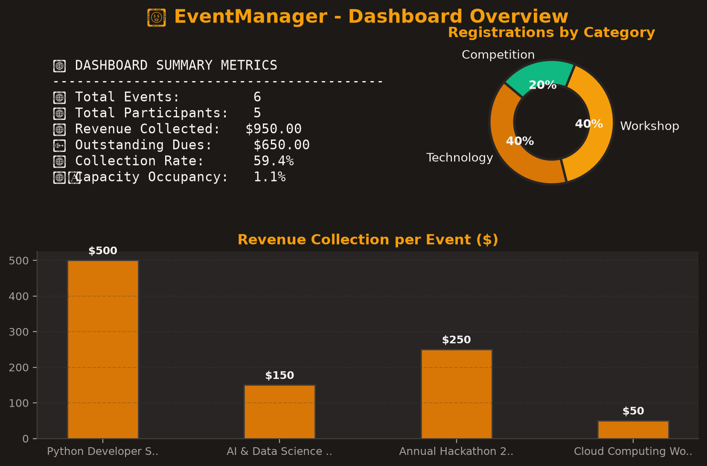
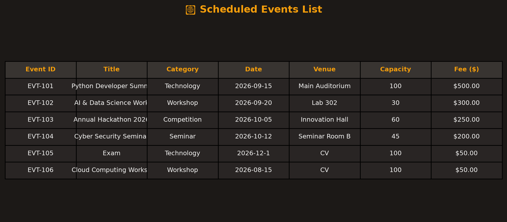
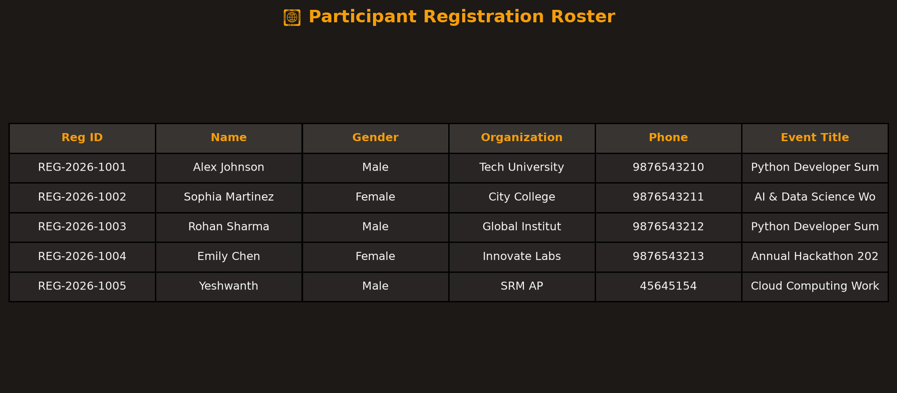
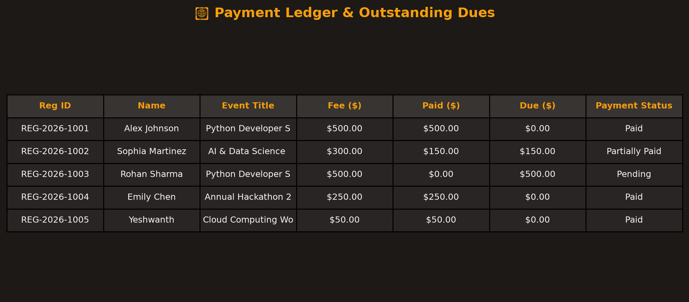
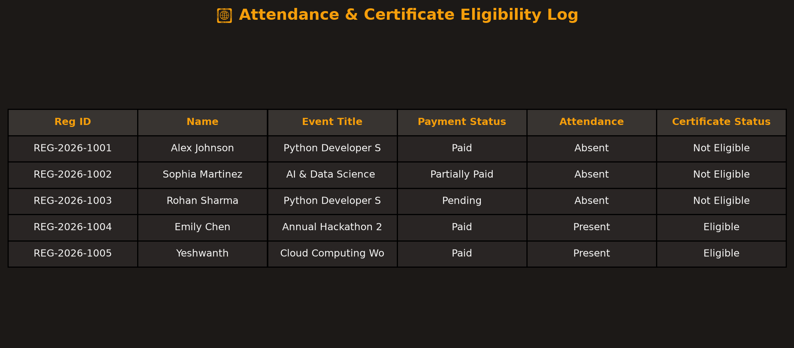
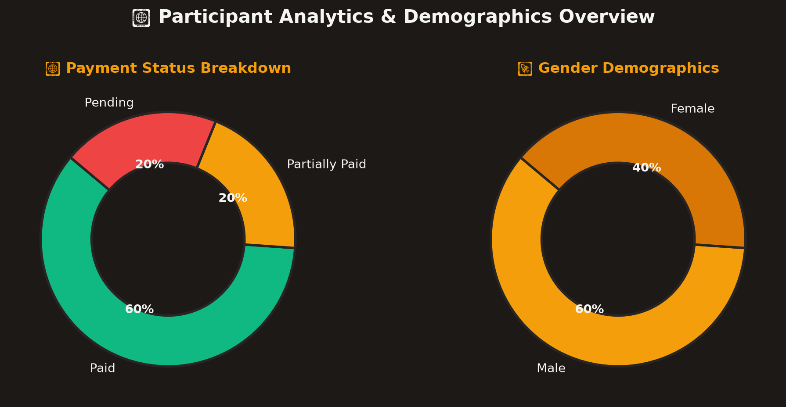

# 🤎 EventManager — Desktop Event Management System

[](https://www.python.org/)
[](https://github.com/TomSchimansky/CustomTkinter)
[](https://matplotlib.org/)
[](https://www.json.org/)

A modern, offline-first desktop application built for administrators to easily organize university events, manage attendee registrations, track fee collections, monitor attendance, and analyze metrics. Built entirely in Python using **CustomTkinter** for a polished dark mocha/bronze theme and **Matplotlib** for integrated analytical charts.

---

## 📸 Application Screenshots

### 📊 System Dashboard Overview

*Real-time metrics, registration donut chart, and revenue bar graph.*

### 📅 Events Management

*Schedule events, set capacities, track occupied seats, and manage lists.*

### 📝 Participant Registration

*Register participants with formatting validation and automatic unique Registration ID generation.*

### 💳 Payments Ledger & Outstanding Dues

*Record partial/full payments across different modes (UPI, Cash, Card) and calculate dues.*

### 📋 Attendance & Certificate Verification

*Mark attendance and verify certificate eligibility dynamically based on payment status and presence.*

### 📈 Participant Demographics & Metrics

*Analyze participant registrations by gender, payment status, and category.*

---

## ✨ Key Features & Functions

- **Top Navigation Bar:** Horizontal layout replacing legacy sidebars with a sleek, space-efficient horizontal pill navigation, live clock, and user badge.
- **Event Scheduling:** Predefined seats, category tagging, fee configuration, and dynamic seat capacity enforcement.
- **Form Validation:** Validates email format (regular expressions), mobile phone format, and age constraints (`1` to `120`).
- **Payment tracking:** Automatically tracks and calculates paid, partial, or pending payment status, transaction modes, and outstanding balances.
- **Attendance-based Certificates:** Automated rule engine dictates that a participant is only eligible for a certificate if marked `Present` AND payment status is `Paid`.
- **System Reports & Exports:** Generates text reports (`.txt`) and exports data lists directly to spreadsheet-ready CSV files (`.csv`). Includes a built-in monospace report previewer.

---

## 🛠️ Tech Stack & Requirements

- **Runtime:** Python 3.8+
- **GUI Engine:** CustomTkinter & Tkinter (fallback support)
- **Data Visualizations:** Matplotlib
- **Persistence:** Local JSON Data Files

---

## 🚀 Quick Start Guide

### 1. Clone & Navigate
```bash
git clone https://github.com/YEsh-DEV/Event-Mangement.git
cd Event-Mangement
```

### 2. Install Dependencies
```bash
pip install -r requirements.txt
```

### 3. Run the App
```bash
python main.py
```

*Note: On first run, the app automatically pre-populates sample events and participant registrations (in `data/`) so you can test all views instantly.*

---

## 📂 Source Code Architecture

| File | Purpose |
| :--- | :--- |
| `main.py` | Launches the CustomTkinter GUI mainloop. |
| `ui.py` | Contains UI components (`ModernHeader`, `KPICard`, `ChartWidget`) and layout. |
| `events.py` | Handles event creation, capacity logic, and deletions. |
| `registration.py` | Handles participant validations, Reg ID generation, and search indexing. |
| `payments.py` | Updates amounts paid, payment statuses, and aggregates financial metrics. |
| `attendance.py` | Marks attendance states and verifies certificate rules. |
| `analytics.py` | Aggregates gender distribution, status breakdown, and handles daily insights. |
| `reports.py` | Formats data for plain text output and write logs/spreadsheets to CSV. |
| `utils.py` | Contains validation regex helpers and the JSON storage adapter. |

---

## 🎓 Academic Viva Cheat Sheet

**Q: Where and how is application data stored?**  
A: Data is persisted locally in `data/events.json` and `data/participants.json` using Python's built-in `json` module. It uses `try-except` blocks to handle any missing files or parsing corruptions gracefully.

**Q: How are Matplotlib figures integrated with CustomTkinter?**  
A: The figures are rendered to Tkinter canvases using the `FigureCanvasTkAgg` backend. Matplotlib drawing resources are cleanly closed on view switches to prevent memory leaks.

**Q: How is Certificate Eligibility verified?**  
A: In `attendance.py` and `payments.py`, eligibility evaluates `attendance == "Present" and payment_status == "Paid"`.

**Q: How does registration capacity check work?**  
A: Before saving a participant registration in `registration.py`, the system queries the active enrollment count. If this count matches the event's max capacity, registration is rejected.

---

## 📄 License
This project is licensed under the MIT License - feel free to use and modify it for academic purposes.
